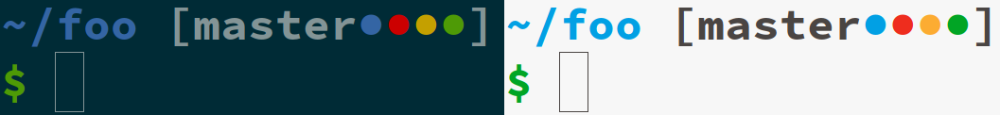

# [Nidoranarion Theme](https://github.com/NicolaiRuckel/nidoranarion)

A very good prompt for ZSH. It also works as a theme for Oh-My-Zsh.
It is intended for my personal use so the features can feel limited to other
people. For example, I omit the username on purpose since I rarely have to
switch back and forth between local and remote terminals.

You can just source it in your `.zshrc` or install it as a theme for Oh-My-Zsh.

## Features

* no Powerline fonts required
* support for Git (it is the only VCS that is supported since I don’t use
  anything else anyway)
* theme doesn’t specify any colors explicitly but uses the terminal colors
* no user name in prompt

## Screenshot

With a dark/light terminal colorscheme:

The circles are VCS indicators. From left to right: Untracked files, unstaged
files, staged files, unpushed commits.
